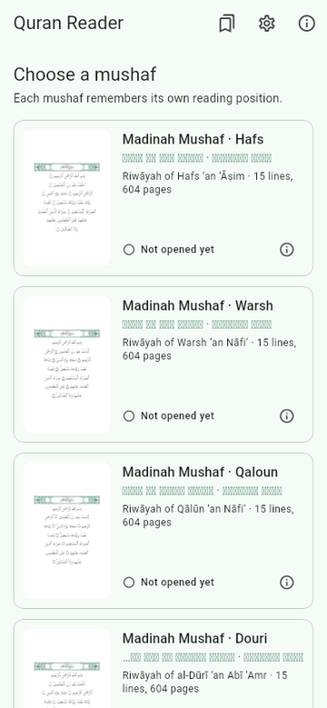
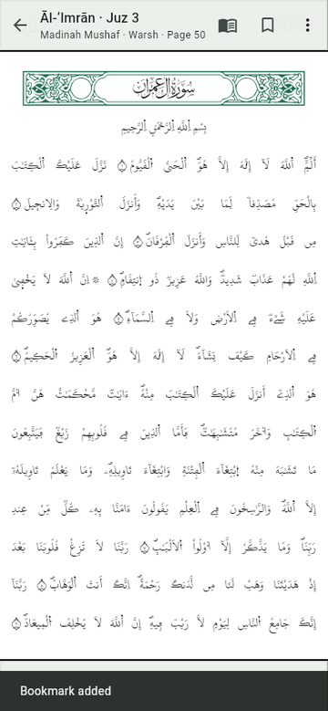
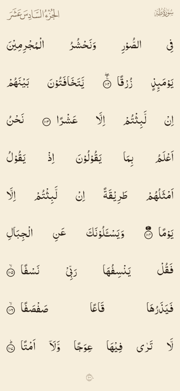
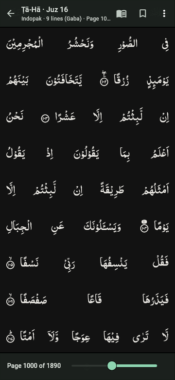

# Quran Reader

A Flutter app for reading the Quran page by page, line by line, exactly as in the printed mushafs.
Reading only: no tafsir, translation or audio. Fully offline, no data collected.

- Application id: `fi.mazhar.quran.reader`
- Platforms: Android and iOS
- UI languages: English and Arabic

<p>




</p>

## Mushafs

The home screen lets the reader choose the mushaf; each one remembers its own last page.

| mushaf | layout | text and font |
|---|---|---|
| Madinah Mushaf · Hafs | 604 pages × 15 lines | KFGQPC Uthmanic Hafs |
| Madinah Mushaf · Warsh | 604 × 15 | KFGQPC Uthmanic Warsh |
| Madinah Mushaf · Qaloun | 604 × 15 | KFGQPC Uthmanic Qaloun |
| Madinah Mushaf · Douri | 604 × 15 | KFGQPC Uthmanic Douri |
| Madinah Mushaf · Shu'bah | 604 × 15 | KFGQPC Uthmanic Shu'bah |
| Madinah Mushaf · Sousi | 604 × 15 | KFGQPC Uthmanic Sousi |
| Mushaf Qatar · Hafs | 604 × 15 (Qatar print, QUL) | KFGQPC Hafs |
| Indopak · 9 lines (Gaba) | 1890 × 9 (QUL) | QUL IndoPak text, AlQuran IndoPak font |

## Features

- Mushaf picker with a live rendering of each mushaf's first page, continue-reading card
- Page reader: right-to-left page turning, every page drawn line by line at the printed line breaks
  (custom justified line layout), calligraphic surah headers and basmalas, surah · juz · page labels
- Go to surah, juz or page; page slider
- Page and ayah bookmarks (long-press a word to pick its ayah)
- Light, sepia and dark pages; whole-page or full-width fit; keep screen on;
  two pages side by side in landscape on tablets
- About screen with the sources and credits KFGQPC and QUL ask for

## Build and run

```sh
flutter pub get
flutter run
```

The content database (`assets/db/quran_reader.db`) and fonts (`assets/fonts/`) are committed, so the
app builds without running the data pipeline.

SQLite comes from [`package:sqlite3`](https://pub.dev/packages/sqlite3): on Android and iOS its build
hook bundles the package's checksummed SQLite binaries (downloaded from the package's GitHub releases
at build time). On Linux, used for `flutter test`, it uses the system library; install
`libsqlite3-dev` if `libsqlite3.so` is missing.

## Tests

```sh
flutter analyze
flutter test                      # unit, database, line-fit and end-to-end widget tests
SCREENSHOTS=1 flutter test test/app_flow_test.dart   # also writes build/screens/*.png
flutter test --tags preview --run-skipped             # sample page renders in build/preview/
```

`test/line_fit_test.dart` renders pages of every mushaf and checks that no printed line needs to be
squeezed to fit, i.e. that the geometry the pipeline measured agrees with Flutter's own shaping.

## Data pipeline

`tools/` turns the raw KFGQPC and QUL material in `resources/` into the app's database and fonts,
validating every step (see [docs/03-data-pipeline.md](docs/03-data-pipeline.md)):

```sh
pip install fonttools pillow
python3 -m tools.build     # assets/db/quran_reader.db + assets/fonts/
python3 -m tools.icons     # launcher icons
```

## Documentation

- [docs/README.md](docs/README.md): planning documents (resource inventory, app plan, data pipeline)
- [docs/04-implementation.md](docs/04-implementation.md): what is built, how it was verified, findings
- [docs/ereader-pdf/](docs/ereader-pdf/README.md): e-reader PDF books from the same data

## Credits

Quran text and fonts: King Fahd Glorious Quran Printing Complex (KFGQPC). Page layouts, IndoPak text,
surah-name and ornament fonts: Quranic Universal Library (QUL) by Tarteel. AlQuran IndoPak font:
QuranWBW. The Quranic text is used unaltered.
